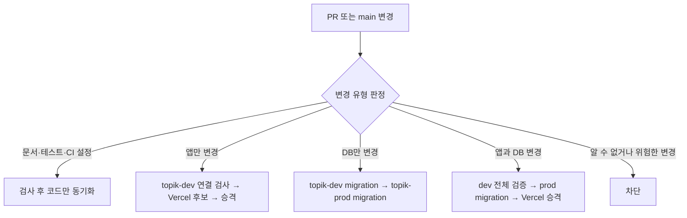

# TOPIK Admin 변경 유형 기반 CI/CD 및 자동 배포 파이프라인

## 1. 목적과 환경 경계

`blackstarzck/topik-ai`를 검증 기준 저장소로 사용한다. localhost와 main 이후 개발 검증은 `topik-dev`, Vercel Production 후보와 운영 도메인은 `topik-prod`만 사용한다. 회사 저장소 `keduall/topik-admin`은 검증된 코드 commit의 mirror이며 dev/prod 데이터를 동기화하지 않는다.

hook, PR 온라인 Preview, Vercel Git 자동 배포는 사용하지 않는다. GitHub Actions가 PR 검사, 개발 검증, 회사 저장소 코드 동기화, 운영 반영을 순서대로 실행한다.

## 2. 변경 분류 계약

`scripts/ci/classify-release-change.mjs`는 base부터 exact head SHA까지 rename·delete를 포함한 전체 `git diff`를 검사한다.

| release plan | 대상 | 앱 배포 | DB 적용 | 검증 수준 |
| --- | --- | --- | --- | --- |
| `sync-only` | 문서, 오프라인 테스트, workflow, CI/DB runner, down 파일 | 없음 | 없음 | `light` 또는 `full` |
| `app-only` | `src`, `api`, `public`, package/build/Vercel 입력 | 실행 | 없음 | `app` |
| `db-only` | 신규 forward migration만 추가 | 없음 | 실행 | `full` |
| `app-db` | 앱 입력과 신규 forward migration을 함께 변경 | 실행 | 실행 | `full` |
| `blocked` | 알 수 없는 경로, 해석 불가 SHA, 기존 forward migration 수정·삭제·이름 변경 | 없음 | 없음 | 실패 |

신규 forward migration은 `supabase/migrations` 또는 `supabase/migrations-admin`에 `A` 상태로 추가된 SQL만 인정한다. 이미 기록된 migration은 불변 이력으로 취급한다. 혼합 변경은 `deployApp`과 `applyMigrations`를 각각 계산하므로 DB만 바뀐 경우 Vercel을 실행하지 않는다.

분류 artifact schema v2는 `releasePlan`, `deployApp`, `applyMigrations`, `validationProfile`, `classifierVersion`, `changedFilesDigest`, `baseSha`, `headSha`를 기록한다. 알 수 없는 변경은 추정 배포하지 않고 `blocked`로 종료한다.

## 3. PR 필수 검사

`.github/workflows/ci.yml`은 workflow-level path filter 없이 모든 `main` 대상 PR에서 시작한다. PR에서는 hosted Supabase와 Vercel 비밀을 사용하지 않으며 실제 DB나 배포 환경을 변경하지 않는다.

- `light`: 문서 계약과 변경된 unit/mock E2E만 실행한다.
- `app`: harness, 비밀 경계, migration manifest, unit, build, 전체 mock Playwright를 실행한다.
- `full`: app 검사에 고정 v13 → `topik_writing` → admin shadow 전체 재생, migration 경계·manifest·expand 계약을 추가한다.
- `ci-gate`: 분류기가 선택한 job만 정확히 성공했는지 확인하는 단일 required check다.

expand 게이트는 기존 객체의 `DROP`을 계속 차단한다. 단, 같은 PR의 앞선 신규
migration이 `CREATE FUNCTION name()`으로 처음 도입한 0인자 함수를 뒤의 신규
migration이 동일 이름으로 즉시 재생성하는 경우만 단일 미출시 release 안의
정의 보정으로 인정한다. 기존 함수, 인자가 있는 함수, procedure, 재생성 없는
삭제는 이 예외에 포함되지 않는다.

workflow·CI runner 같은 control-plane 변경은 실제 배포를 만들지 않지만 `full` 검사를 통과해야 회사 저장소에 동기화된다.

## 4. main과 topik-dev 검증

`.github/workflows/release-development.yml`은 `origin/main` push마다 실행한다. 실행은 `queue: max`로 직렬화하며 진행 중인 릴리스를 취소하지 않는다.

이미 검증된 최신 `main`을 운영에 전체 재적용해야 할 때는 같은 workflow의 `workflow_dispatch`를 사용한다. 수동 실행은 `main` ref, `app-db` 계획, `topik-prod` 확인 문자열을 모두 요구한다. 분류 artifact에는 자동 분류 결과와 수동 재실행 여부를 함께 기록하며, 일반 push의 자동 분류는 변경하지 않는다. 수동 재실행도 아래의 topik-dev 전체 검증과 Production evidence 검증을 생략하지 않는다.

- `sync-only`: `light` 또는 `full` 오프라인 검증 후 schema v3 evidence를 작성한다. topik-dev를 변경하지 않는다.
- `app-only`: migration을 적용하지 않는다. topik-dev tracker clean, Users RPC·권한을 확인하고 현재 관리자 계정으로 운영 스모크를 수행한다.
- `db-only`와 `app-db`: 전체 shadow를 재생하고 `topik_writing` → admin 순서로 topik-dev expand migration을 적용한다. tracker·RPC·권한·shadow fingerprint, 관리자 Users 흐름과 정기 쿠폰 CRUD·감사 로그를 검증한다.
- `blocked`: evidence를 만들지 않고 종료한다.

development evidence schema v3는 base/head SHA, v13 SHA, dev project ref, 네 release plan, 두 실행 flag, validation profile, 변경 파일 digest와 각 검사의 `passed | not-required` 상태를 기록한다. artifact에는 토큰, 이메일, 전화번호, SQL 결과 행을 넣지 않는다.

## 5. 회사 저장소와 Production

`.github/workflows/release-production.yml`은 성공한 `Validate development`의 exact `head_sha`와 schema v3 evidence만 받는다.

1. evidence의 SHA·v13 SHA·topik-dev ref·release plan·필수 검사 상태를 다시 검증한다.
2. 검증된 SHA를 `keduall/topik-admin/main`으로 fast-forward한다. 동일 SHA면 통과하고, 더 최신 검증 SHA가 이미 있으면 이전 실행을 `superseded`로 종료하며, 분기되면 차단한다.
3. `sync-only`는 DB와 Vercel 작업 없이 종료한다.
4. `db-only`는 현재 운영 앱을 먼저 확인한 뒤 `topik_writing` → admin 순서로 topik-prod migration을 적용한다. tracker·RPC·권한과 변경되지 않은 운영 앱을 다시 확인하고 종료한다. Vercel candidate·promote·rollback 명령을 실행하지 않는다.
5. `app-only`는 topik-prod tracker가 clean인지 확인하고 Vercel Production 후보를 테스트한 뒤 승격한다. migration을 적용하지 않는다.
6. `app-db`는 Production 후보를 먼저 빌드하고 현재 운영 앱을 확인한다. topik-prod migration 후 기존 운영 앱 호환성, 후보 E2E를 차례로 확인한 뒤 후보를 승격한다.

Vercel 후보는 Production 환경 변수로 빌드하지만 `--skip-domain`으로 운영 도메인에 연결하지 않는다. Production runner는 DB 변경 전 운영 스모크부터 후보·승격 후 스모크까지 동일한 Playwright Chromium을 명시적으로 설치해 사용한다. 검증 후 `vercel promote`로 같은 artifact를 재빌드 없이 전환한다. 운영 스모크 실패 시 Vercel alias만 이전 deployment로 되돌린다. DB down migration은 자동 실행하지 않고 roll-forward로 복구한다.

## 6. GitHub·Supabase·Vercel 설정

- GitHub `development` environment는 `main`만 허용하고 topik-dev ref, Management API token, 현재 관리자 계정, 브라우저 publishable 설정을 보관한다.
- GitHub `Production` environment는 `main`만 허용하고 topik-prod ref, Vercel project/team/domain, Management API·Vercel·mirror token, 현재 관리자 계정을 보관한다. 사람 승인자는 두지 않는다.
- `MIRROR_GITHUB_TOKEN`은 `keduall/topik-admin` contents 쓰기 범위로 제한한다.
- `blackstarzck/topik-ai`의 `main` PR merge actor는 `blackstarzck`으로 고정한다. 해당 GitHub 자격 정보가 없거나 확인할 수 없으면 merge를 일시중단하며 다른 계정으로 대체하지 않는다.
- `collab`·`keduall` push 또는 merge actor는 `guestkeduall-design`, Git commit author는 `guestkeduall-design <guestkeduall@gmail.com>`으로 고정한다. 자격 정보나 identity가 일치하지 않으면 중단하고, 기존 commit을 자동 rewrite하지 않는다.
- Node `24.x`, Supabase CLI `2.105.0`, Vercel CLI `48.12.0`을 고정한다.
- Vercel 대상은 `topik-admin`의 team/project ID로 고정하며 로컬 `.vercel/project.json`은 CI 배포 근거로 사용하지 않는다.
- Vercel Git 자동 배포와 Production domain 자동 할당을 끄고 GitHub Actions만 배포 권한을 가진다.
- 새 public table/function은 Data API 노출을 가정하지 않고 필요한 role의 명시적 `GRANT`, RLS, 관리자 권한 계약을 migration과 검증에 포함한다.

## 7. 실패와 정기 점검

- dev 검증 실패: 회사 저장소, topik-prod, Vercel을 변경하지 않는다.
- prod DB 적용 전 실패: 현재 운영 상태를 유지한다.
- prod migration 후 실패: 앱을 승격하지 않고 DB는 자동 down하지 않는다. 수정 migration으로 roll-forward한다.
- 후보 E2E 실패: 현재 운영 앱을 유지한다.
- 승격 후 운영 스모크 실패: 저장한 이전 Vercel deployment로 alias를 복구한다. DB는 유지한다.

`.github/workflows/database-health.yml`은 매일 03:17 KST에 전체 shadow 재생과 topik-dev/topik-prod tracker·RPC·권한 fingerprint를 읽기 전용으로 검사한다. 실패해도 migration이나 배포를 실행하지 않는다.

migration·분류·배포 evidence는 90일 보관한다. workflow는 `origin/main`에 병합된 뒤부터 실제로 작동하며 feature branch에만 존재하는 동안에는 dev/prod 자동 릴리스를 시작하지 않는다.
