# TOPIK Admin CI/CD 및 자동 배포 파이프라인

## 1. 목적과 환경 경계

`blackstarzck/topik-ai`를 검증 기준 저장소로 사용하되, 운영 릴리스 전에 반드시 같은 commit SHA를 `topik-dev`에 적용하고 실제 관리자 흐름을 확인한다. localhost와 개발 검증은 `topik-dev`, Vercel Production 후보와 운영 도메인은 `topik-prod`만 사용한다.

hook, PR 온라인 Preview, Vercel Git 자동 배포는 사용하지 않는다. GitHub Actions가 마이그레이션과 Vercel staged deployment를 단일 순서로 실행한다.

```mermaid
flowchart LR
    A["blackstarzck/topik-ai PR"] --> B["정적 검사·shadow DB·mock E2E"]
    B --> C["origin/main 병합"]
    C --> D["topik-dev migration"]
    D --> E["dev DB·권한·CRUD·브라우저 E2E"]
    E --> F["검증 artifact"]
    F --> G["keduall/topik-admin main fast-forward"]
    G --> H["topik-prod migration·Production 후보"]
    H --> I["후보 운영 E2E"]
    I --> J["Production 승격"]
    J --> K["운영 스모크·오류 감시"]
```

## 2. PR 필수 검사

`.github/workflows/ci.yml`은 운영 비밀이나 원격 Supabase 프로젝트를 사용하지 않는다.

- `quality`: Node 24에서 install, harness, 전체 unit, production build를 실행한다.
- `db-contract`: 고정 v13 SHA와 로컬 Supabase shadow DB로 v13 → `topik_writing` → admin migration을 재생한다. development/production manifest, down pair, expand-only 규칙, Users RPC·권한·fingerprint를 검사한다.
- `browser-e2e`: Supabase가 비활성화된 결정적 mock 환경에서 전체 Playwright 회귀 검사를 실행한다.

세 job이 모두 성공해야 `origin/main`에 병합할 수 있다.

## 3. topik-dev 검증

`.github/workflows/release-development.yml`은 `origin/main` push마다 취소 없이 직렬 실행한다. GitHub `development` environment의 대상 ref는 `fglggyfvzjdsbyckinqa`로 고정한다.

1. exact main SHA, 고정 v13 SHA, topik-dev URL/ref와 비밀 구성을 검증한다.
2. PR 품질·DB·shadow·mock 브라우저 검사를 동일 SHA에서 재실행한다.
3. `topik_writing` → admin 순서로 development manifest의 `release-all`을 적용한다.
4. tracker의 기존 미기록 checksum을 baseline하고 전체 pending·checksum·remote-only·blocked 상태를 fail-closed로 대사한다.
5. Users RPC 정의·결과 컬럼·anon 거부·authenticated 관리자 권한과 shadow fingerprint를 확인한다. dev의 legacy `profiles.phone` 존재는 허용하되 RPC가 그 컬럼에 직접 의존하면 실패한다.
6. topik-dev로 빌드한 앱을 localhost에서 실행하고 현재 관리자 계정으로 Users 목록·상세·내보내기·감사 로그와 정기 쿠폰 생성→조회→수정→삭제→감사 로그를 검증한다.
7. SHA, v13 SHA, migration 결과, 권한·CRUD·브라우저 결과만 포함한 PII-free artifact를 90일 보관한다.

개발자는 이 실행과 artifact에서 dev 적용 결과를 확인할 수 있다. 별도 사람 승인 버튼은 두지 않으며, dev workflow가 성공한 경우에만 다음 workflow가 자동 시작된다.

## 4. 회사 저장소와 topik-prod 릴리스

`.github/workflows/release-production.yml`은 `Validate development` workflow의 `workflow_run` 성공 이벤트만 받는다. `push`나 수동 dispatch로 dev 검증을 우회할 수 없다.

1. dev 실행의 exact `head_sha`를 checkout한다.
2. 해당 실행의 artifact를 다운로드하고 SHA·v13 SHA·topik-dev ref·tracker·권한·CRUD·브라우저 성공 표식을 검증한다.
3. 검증된 SHA를 private `keduall/topik-admin/main`에 fast-forward한다. 회사 저장소가 앞서 있거나 분기됐으면 중단한다.
4. 현재 Production deployment ID를 rollback 대상으로 저장한다.
5. Vercel production 환경을 pull하고 CLI `48.12.0`으로 prebuilt 후보를 만든 뒤 `--prod --skip-domain`으로 alias 없이 배포한다.
6. `topik_writing` → admin 순서로 topik-prod expand migration을 적용한다.
7. production tracker 전체 일치, legacy `profiles.phone` 부재, Users RPC fingerprint·권한을 dev shadow 결과와 대사한다.
8. 후보 URL에서 현재 관리자 계정으로 Users read-only E2E를 통과시킨다.
9. `vercel promote`로 재빌드 없이 `topik-admin.vercel.app`에 연결한다.
10. 실제 운영 도메인에서 같은 E2E와 runtime error 감시를 수행한다.

Vercel 후보는 항상 topik-prod 환경으로 빌드된다. 로컬 `.vercel/project.json`은 릴리스 입력으로 사용하지 않으며 project/team ID를 GitHub `production` environment 변수로 고정한다.

## 5. 마이그레이션 계약

두 환경 모두 별도 manifest를 사용하고 실제 target ref가 manifest와 다르면 쓰기를 거부한다.

- development: `writing-development-release.json`, `admin-development-reconciliation.json`
- production: `writing-production-cutover.json`, `admin-production-cutover.json`
- 자동 순서: `topik_writing` → admin
- `--verify-all --require-clean`: manifest 누락, down pair 누락, pending, checksum 누락·불일치, 승인되지 않은 remote-only, 적용된 blocked migration을 모두 실패 처리
- 신규 자동 적용: 이전 앱과 호환되는 expand migration만 허용
- 금지: v13 소유 객체 DDL/DML, 기존 migration 수정·삭제, 자동 down migration

DB 적용 뒤 앱 검증이 실패해도 down migration은 실행하지 않고 roll-forward한다.

## 6. GitHub 환경 변수와 비밀

`development` environment:

- Variables: `SUPABASE_PROJECT_REF=fglggyfvzjdsbyckinqa`, `SUPABASE_EXPECTED_PROJECT_REF=fglggyfvzjdsbyckinqa`, 고정 `V13_CONTRACT_SHA`
- Secrets: `SUPABASE_ACCESS_TOKEN`, `E2E_ADMIN_EMAIL`, `E2E_ADMIN_PASSWORD`, `VITE_SUPABASE_URL`, `VITE_SUPABASE_PUBLISHABLE_KEY`

`production` environment:

- Variables: `SUPABASE_PROJECT_REF=eymlabowhfgtxbiqwxqh`, `SUPABASE_EXPECTED_PROJECT_REF=eymlabowhfgtxbiqwxqh`, `VERCEL_ORG_ID`, `VERCEL_PROJECT_ID`, `PROD_ADMIN_DOMAIN`, 고정 `V13_CONTRACT_SHA`
- Secrets: `SUPABASE_ACCESS_TOKEN`, `VERCEL_TOKEN`, `E2E_ADMIN_EMAIL`, `E2E_ADMIN_PASSWORD`, `MIRROR_GITHUB_TOKEN`

`MIRROR_GITHUB_TOKEN`은 `keduall/topik-admin`에만 `Contents: Read and write` 권한을 가진 fine-grained token이다. 조직 전체 deploy key 정책은 변경하지 않는다.

Vercel `topik-admin` 프로젝트의 Git 연결은 해제한다. 따라서 회사 저장소 `main` fast-forward 자체는 배포를 만들지 않으며, 위 production workflow의 고정 project/team ID를 사용하는 Vercel CLI만 후보 생성·승격·rollback 권한을 가진다. 저장소의 로컬 `.vercel/project.json`은 다른 프로젝트를 가리키므로 릴리스 입력으로 사용하지 않는다.

## 7. 실패 처리

- dev migration 전 실패: DB 변경 없이 종료
- dev migration 후 검증 실패: production workflow 미실행, dev는 roll-forward로 수정
- 회사 저장소 fast-forward 실패: topik-prod와 Vercel 변경 전 중단
- Production 후보 빌드 실패: topik-prod migration 전 중단
- topik-prod migration 또는 후보 E2E 실패: Production alias 유지
- 승격 후 운영 스모크 실패: 저장한 이전 deployment ID로 Vercel alias 자동 rollback
- release evidence에는 토큰, 이메일, 전화번호, SQL 결과 행, 다운로드 파일, 화면 캡처, raw runtime log를 포함하지 않음

같은 환경의 실행은 GitHub concurrency로 직렬화하며 진행 중 실행을 취소하지 않는다.
