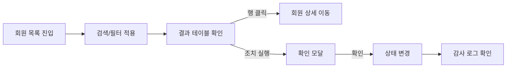
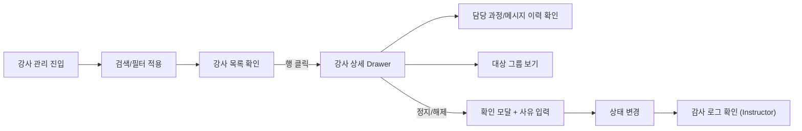
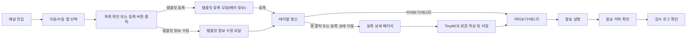
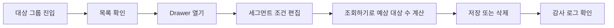
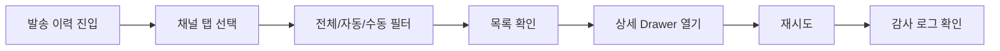
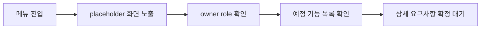

# TOPIK AI Admin 페이지 흐름도

## 개요

- 공통 흐름은 `검색/필터 -> 상세/확인 -> 조치 -> 피드백 -> 감사 로그 확인`입니다.
- placeholder 모듈은 `메뉴 진입 -> 역할/예정 기능 확인 -> 상세 정의 대기` 흐름을 가집니다.

## Users > 회원 목록

## Users > 강사 관리

## Message > 메일 / 푸시

## Message > 대상 그룹

## Message > 발송 이력

## Assessment / Content Placeholder

