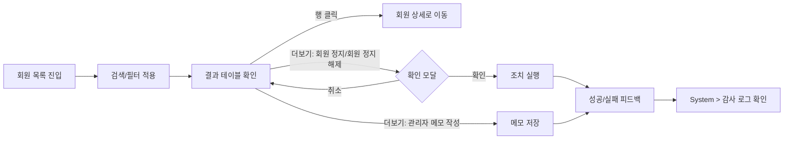
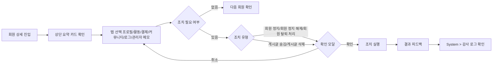
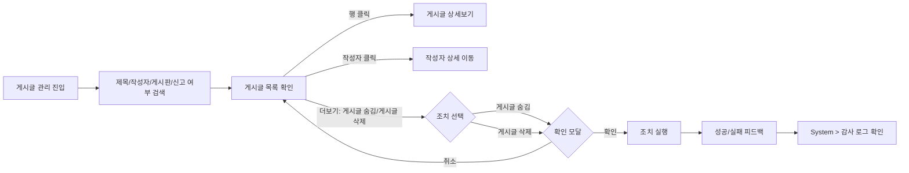
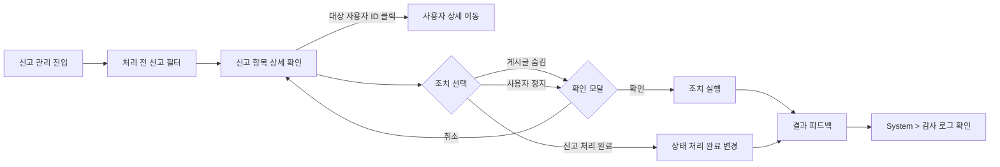
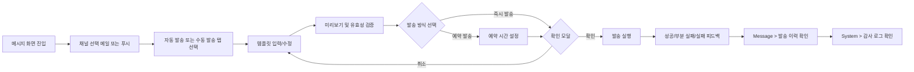
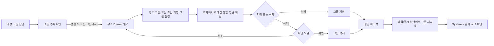
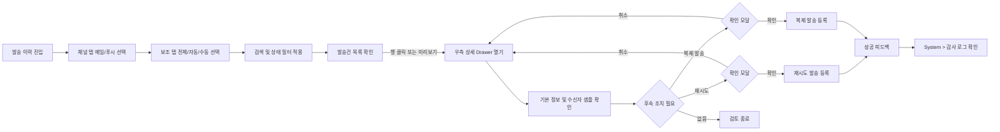
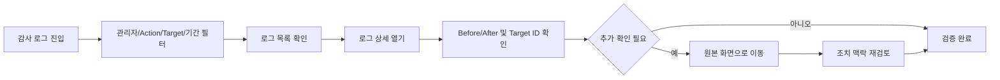

# TOPIK AI Admin 페이지 흐름도 (Page Flows)

## 문서 계약

- 고정 8개 모듈: Dashboard, Users, Community, Message, Operation, Billing, Analytics, System
- 메뉴명은 `Users`(복수형)로 표기하며, `User` 단수형 사용을 금지합니다. (참조: `docs/architecture/admin-information-architecture.md:63`)
- 감사 로그 용어는 `감사 로그`로 통일합니다. (참조: `docs/architecture/admin-information-architecture.md:64`, `docs/specs/admin-action-log.md:4`)
- `시스템 로그`는 기술 로그로 감사 로그와 구분합니다. (참조: `docs/architecture/admin-information-architecture.md:65`)
- Users 상세 탭 고정: `프로필`, `활동`, `결제`, `커뮤니티`, `로그`, `관리자 메모` (참조: `docs/architecture/admin-information-architecture.md:66`)
- 금지 범위 및 용어: `Learning`, `Content/Course` (참조: `docs/architecture/admin-information-architecture.md:67`)

## 근거 문서

- `docs/architecture/admin-information-architecture.md`
- `docs/specs/admin-page-analysis.md`
- `docs/specs/admin-page-tables.md`
- `docs/specs/admin-user-detail-page-structure.md`
- `docs/specs/admin-action-log.md`

## 페이지 흐름도 개요

- 본 문서는 `docs/guidelines/admin-ux-ui-design.md`의 UX 내러티브를 다이어그램으로 고정합니다.
- 공통 흐름은 `검색/필터 -> 상세/확인 -> 조치 -> 피드백 -> 감사 로그 확인`입니다.
- 파괴적 조치(정지/삭제/숨김/사용자 정지)는 의사결정 노드로 확인 단계를 명시합니다.

## 주요 사용자 시나리오 흐름

### Users > 회원 목록

### Users > 회원 상세

### Community > 게시글 관리

### Community > 신고 관리

### Message > 메일 / 푸시 발송

### Message > 대상 그룹

### Message > 발송 이력

### System > 감사 로그

